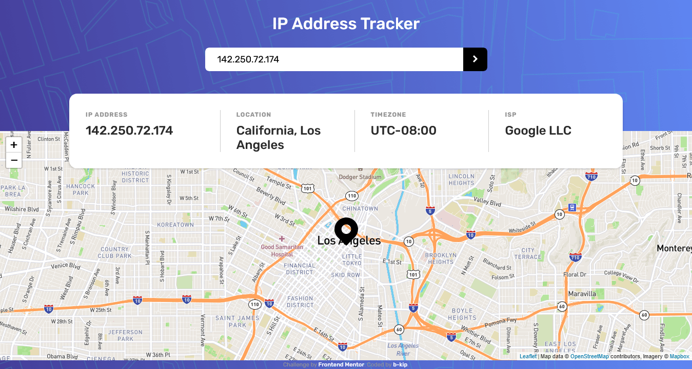
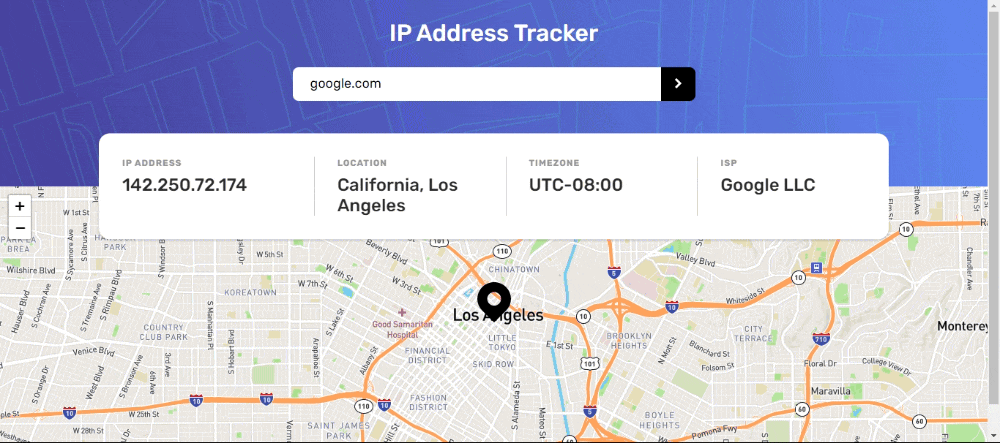

# IP Address Tracker: IP address and domain information
IP Address Tracker is a React app that allows users to search and view geographical, timezone and ISP information of any IP address or domain.
## Overview
On the first load, the app shows your IP address' region, city, timezone, ISP and loads its location on the map. Every subsequent search for a specific IP Address or domain will update the information on the page. You can zoom in and out of the map for a better view.

This app fetches IP addresses and domain information from the [IP Geolocation API](https://geo.ipify.org/). [React Leaflet](https://react-leaflet.js.org/) that binds to [Leaflet JS](https://leafletjs.com/) was used to create the interactive map.
### Functionality and Features

Users should be able to:

- View the optimal layout depending on their device's screen size
- See hover states for all interactive elements on the page
- See their own IP address on the map on the initial page load
- Search for any IP addresses or domains and see the key information and location
- See an error message if they input an invalid IP address or domain
- See an error message if they search for a non-existent IP address or domain

### Screenshot


### Gif

### Links
[Hosted by Vercel](https://iptracker-snowy.vercel.app/) <br/>
[Source on GitHub](https://github.com/b-kip/ip-tracker-master)
## My Process
### Built with

This application was first built using vanilla JavaScript only. In this step I used:

- Semantic HTML5 markup
- CSS custom properties
- Flexbox
- CSS Grid
- Mobile-first workflow
- Sass
- Parcel Bundler

I later converted it to a React application.

### What I learned
- Migrating from Parcel bundler to webpack 4. I learned how to adapt the projects file structure based on how different bundlers handle entry points.
- CSS Grid is better than Flexbox when creating layout that should be consistent when content is dynamic on each search.
- Working with Map API.
### Useful resources
[IP Geolocation API](https://geo.ipify.org/) <br/>
[React Leaflet](https://react-leaflet.js.org/) <br/>
[Leaflet JS](https://leafletjs.com/)
### Continued Development
- Add an history feature to store search results of the last 5 searches
## Setup Locally
To get a local copy up and running locally, follow these simple steps.
### Prerequisites

* npm
  ```sh
  npm install npm@latest -g
  ```

### Installation

1. Clone the repo
   ```sh
   git clone https://github.com/b-kip/ip-tracker-master.git
   ```
2. Install NPM packages
   ```sh
   npm install
   ```
4. Start dev server
   ```sh
   npm start
   ```
## Author

- Frontend Mentor - [Bruce Kip](https://www.frontendmentor.io/profile/b-kip)
- GitHub - [b-kip](https://github.com/b-kip)
